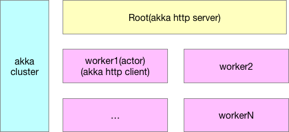

# Ethcube 

对以太坊API进行包装

# 设计

使用 Akka Http 对外提供服务(Root 节点), 内部采用Akka Cluster做分布式服务处理, worker 节点负责连接Geth/Parity客户端获取以太坊数据, 直接返回给调用者。 

## Root节点

Root 节点使用Akka Http对外提供Restful接口, 这里不做数据缓存, 直接利用Akka Cluster技术向worker节点发送请求, 得到数据之后直接返回

## Worker节点

Worker 节点对外是以Actor调用, 参数是以protobuf定义, Worker 节点可以多部署, 由Root节点随机访问, 做均衡请求处理。

# 

